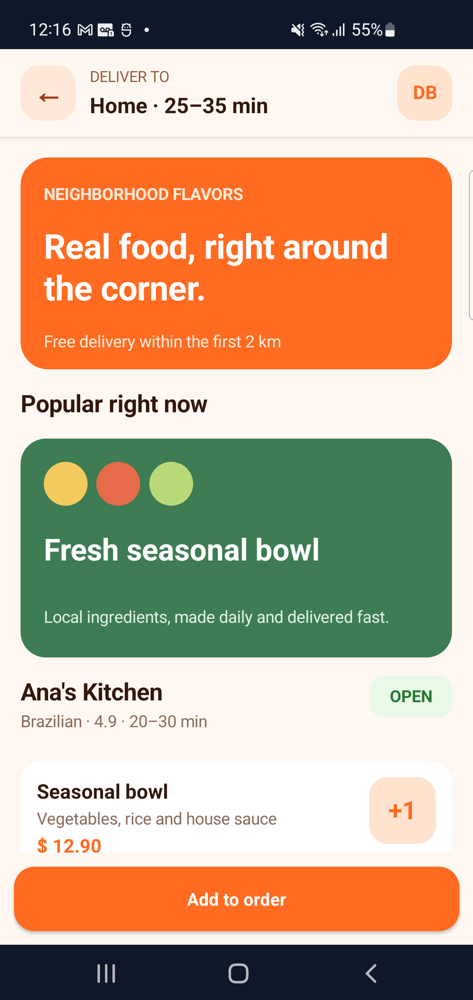
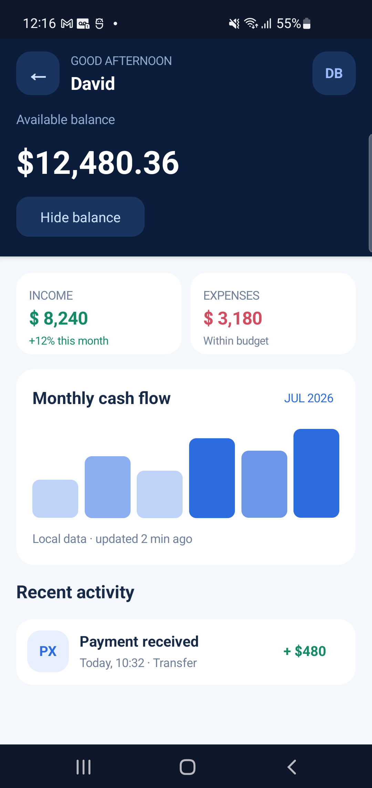
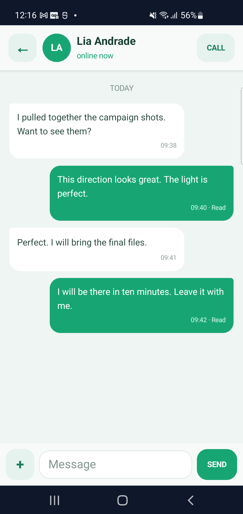
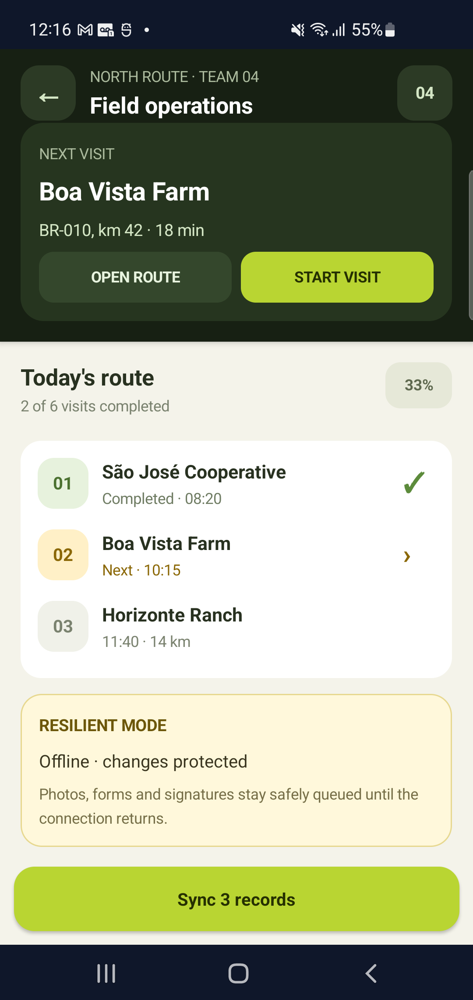

<div align="center">

# PAM Native

### PHP authors the experience. Rust makes it fast. The platform makes it native.

**A retained native application runtime for building Android and iOS apps in
PHP — with real platform controls, a Rust rendering engine, and no JavaScript
runtime.**

[](https://push-in.github.io/pam-docs/native/overview/)
[](https://github.com/push-in/pam-native/actions/workflows/ci.yml)


**[Documentation](https://push-in.github.io/pam-docs/native/overview/) ·
[Components](https://push-in.github.io/pam-docs/native/components/) ·
[Component runtime](https://push-in.github.io/pam-docs/native/component-runtime/) ·
[Global store](https://push-in.github.io/pam-docs/native/global-store/) ·
[Contributing](https://push-in.github.io/pam-docs/community/contributing/)**

</div>

---

Pam Native keeps PHP 8.4 alive inside Android and iOS processes and renders
real platform controls. Rust owns reconciliation and layout; Kotlin and Swift
only apply the resulting native mutations.

This is not PHP drawing pixels through a browser surface. PAM Native owns a
retained element tree, typed props, local reactive state, a Vuex-style global
store, lifecycle, effects, dependency tracking, native navigation, recycled
lists, gestures, media, disk cache, system APIs, diagnostics, and a bounded
binary protocol shared by both platforms.

The goal is unapologetically ambitious: give PHP developers an application
platform they can be proud to put beside fully native stacks—then prove the
claim with protocol tests, compiler checks, simulator builds, and instrumented
Android contracts at both supported API boundaries.

## PAM Native ecosystem

- [PAM Native Nitro](https://github.com/push-in/pam-native-nitro) —
  ultra-fast offline-first models, queries and native SQLite caching.
- [PAM Mobile UI](https://push-in.github.io/pam-docs/mobile-ui/overview/) — optional retained
  Material Design 3 components built on this core.
- [Official documentation](https://push-in.github.io/pam-docs/native/overview/)
  — guides and complete public contracts.
- [PAM platform](https://github.com/push-in/pam) — persistent PHP server
  runtime, async I/O and the wider ecosystem.

## Built with PAM Native

These are screenshots from the same open-source showcase APK running on a
physical Android device. Every control is a retained native view; PHP owns the
application state, Rust reconciles and lays out the tree, and Kotlin renders
the resulting mutations.

<table>
  <tr>
    <td align="center"></td>
    <td align="center"></td>
    <td align="center"></td>
    <td align="center"></td>
  </tr>
  <tr>
    <td align="center"><strong>Local marketplace</strong><br>Catalog and instant cart feedback</td>
    <td align="center"><strong>Offline finance</strong><br>Persistent balance and insights</td>
    <td align="center"><strong>Native chat</strong><br>Focused composer and animated append</td>
    <td align="center"><strong>Field operations</strong><br>Resilient offline synchronization</td>
  </tr>
</table>

Explore the [visual showcase](docs/showcase.md), inspect its
[PHP components and native templates](examples/showcase), or build the APK
locally. The gallery also includes the engineering lab with persistent state,
hot reload and a virtualized list of 10,000 rows.

## Why it is different

| PAM Native owns | What that means |
| --- | --- |
| Persistent PHP runtime | Application and store instances stay alive |
| Rust reconciliation and layout | PHP does not manually diff or position native views |
| Kotlin Views and Swift/UIKit | Users interact with real platform controls |
| Frame-batched commits | Native mutations land once per display frame |
| Native-owned interaction | Scroll, input, gestures, animation and media avoid per-frame PHP traffic |
| Built-in store and component runtime | Props, state, computed values, actions, effects and DevTools are one coherent model |
| Bounded binary protocol | Cross-runtime work is typed, measurable and defended by limits |
| Production diagnostics | Profiling, capability checks, recovery and contract tests ship with the platform |

Install the versioned PHP SDK with Composer:

```bash
composer require pushinbr/pam-native:^0.5
```

Or go from an empty directory to a running native screen:

```bash
pam init hello-native --template mobile
cd hello-native
pam composer install
pam mobile doctor .
pam mobile dev .
```

The generated starter opens with a native counter and a second route, so the
first run proves persistent PHP state, native input and navigation before the
developer adds application code.

Use [Pam Store](docs/store.md) for global reactive state, atomic actions,
computed selectors, persistence, undo/redo and DevTools time travel.
See the [component runtime](docs/component-runtime.md) for typed props, local
state, lifecycle, effects, boundaries, context, slots and refs.
Production compilation, scheduling, dependency tracking and recovery are
covered by the [runtime performance guide](docs/runtime-performance.md).
Browse the [documentation index](docs/README.md) or the
[capability cookbook](docs/examples.md) for copyable examples of every native
feature family.

Android supports API 26–36. Release CI compiles the production renderer,
executes protocol and renderer tests at both API boundaries, and publishes the
plugin API AAR with checksums and build provenance.

## iOS renderer

The UIKit renderer ships as a Swift Package in [`ios`](ios). It covers the
same typed protocol and native component families as Android, including
advanced press, input, modal, image, scroll, refresh, drawer, and semantic
end-reached events. Display-linked mutation and event coalescing target the
native 60–120 Hz refresh cadence without moving network, storage, decoding, or
PHP work onto the main thread.

Add the local package in Xcode and import it from the application host:

```swift
import PamNative
```

The low-level PHP/Rust host bridge remains in `ios/Sources/PamNative/Bridge`
for application-host integration.

## One render tree, several authoring styles

Every public style resolves to the same `Renderable -> Element -> PNT1/PNP1`
path. Choosing tags does not add a second renderer or a web view.

The default project starts with the explicit PHP tree. For Vue/React-like
composition with ordinary PHP classes, constructor props, lifecycle, slots,
directives and local state, PAM also supports single-file `*.pam.php`
components:

```php
final class Card extends Component
{
    public function __construct(
        public string $title,
        public bool $elevated = false,
    ) {}
}
?>

<template>
    <Column :class="['card', 'elevation-2' => $elevated]">
        <Text class="card-title">{{ $title }}</Text>
        <Slot />
    </Column>
</template>

<style scoped>
    .card {
        padding: 16px;
        border: 1px solid #D8D7CF;
        border-radius: 12px;
    }

    .card-title {
        font-family: "Brand";
        font-weight: 700;
        font-size: 18px;
    }
</style>
```

Register them with `App::components(__DIR__.'/src')`. See
[`docs/components.md`](docs/components.md) for the complete syntax and
lifecycle contract. Scoped styles compile directly to typed native properties;
they do not ship a browser CSS engine. A conventional `src/app.css` applies to
every component automatically; component `<style scoped>` rules override it.
Relative `@import` statements are expanded from the file that declares them at
compile time, so fonts, tokens, tag defaults, and semantic classes can be
shared without a runtime stylesheet. PAM uses `p-if`, `p-else-if`, `p-else`,
and `p-for` as its template directives. Native text decoration uses familiar
CSS such as `text-decoration: underline` or `text-decoration: line-through`.

`overflow: hidden` follows the authored native border path. A rounded
`Pressable`, `View`, `Row`, `Column`, or `ImageBackground` therefore clips its
children to the same radius on Android and iOS without a mask component or an
application-side workaround.

The package also installs a deterministic formatter:

```bash
vendor/bin/pam-native-format src
vendor/bin/pam-native-format --check src
```

It indents `*.pam.php`, normalizes scoped styles, removes empty style blocks,
and migrates deprecated `v-*` directive aliases to the canonical `p-*` form.

Typed PHP:

```php
App::run(fn () => Screen::make(
    Column::make(
        Text::make('Checkout')->style(new Style(fontSize: 28)),
        Button::make('Pay')->onPress($pay),
    )->style(new Style(flexGrow: 1, padding: 24, gap: 16)),
));
```

Class component with tags and utility classes:

```php
final class Checkout extends Component
{
    private string $email = '';
    private bool $loading = false;

    public function render(): View
    {
        return View::make('screens.checkout');
    }

    public function pay(): void
    {
        // Business logic remains ordinary PHP.
    }
}

App::views(__DIR__.'/resources/native', __DIR__.'/.pam-native/views');
App::theme(Theme::pamLab());
App::run(new Checkout());
```

```xml
<Screen>
    <SafeAreaView class="flex-1 bg-white">
        <Column class="flex-1 p-6 gap-4">
            <Text height="56" fontSize="28">Checkout</Text>
            <Input
                model="email"
                keyboardType="email"
                sync="debounced"
                placeholder="E-mail"
            />
            <Button loading="$loading" on:press="pay">Pay</Button>
        </Column>
    </SafeAreaView>
</Screen>
```

Templates are parsed once, validated, kept in memory, and optionally stored as
PHP array cache files. Expressions only read component/data paths; templates do
not use `eval`. `If` and `Each` provide conditional and repeated content.
`TemplateRegistry::component()` adds reusable PHP components and
`TemplateRegistry::style()` adds project-specific classes. Registered
components can use `TemplateRegistry::eventAdapter()` to preserve a richer
public callback shape over PAM's bounded binary event channel. Declarative
ancestor event context is composed into registered descendants before their
native elements are built, so compound tags can wire triggers and items
without a runtime tree lookup.

Native handlers may be a public method name or a bounded component expression.
Expressions capture their render scope and run only when dispatched, which
makes per-item actions concise: `on:longPress="select($item['id'])"`.

Android route transitions animate the platform display lists directly instead
of allocating full-screen bitmap layers. This keeps media-heavy first
navigation responsive and avoids a large one-frame texture upload.

`FunctionalComponent::make()` supports standalone functions. A project can mix
functional trees, class components, tags, custom template factories, and direct
`Element` construction in the same screen.

Non-destructive generators cover the common Laravel-style workflow:

```bash
pam mobile make:screen Orders .
pam mobile make:component MetricCard .
pam mobile make:native-view CameraPreview .
pam mobile profile .
```

Semantic tap, pan, pinch, rotation, swipe and long-press recognition is
available through `GestureDetector`; movement is recognized natively and
updates are coalesced before entering PHP. See
[`docs/gestures.md`](docs/gestures.md).

Native Bottom Sheets support snap points, dragging, backdrop dismissal,
keyboard behavior and state-change callbacks on Android and iOS. See
[`docs/bottom-sheet.md`](docs/bottom-sheet.md).

WebView, native media, files/capture, background tasks, notifications, SQLite,
keyframe animation, drag/drop, menus and device APIs are documented in
[`docs/native-capabilities.md`](docs/native-capabilities.md).
Typed permissions, push delivery/opening, continuous observation, lifecycle
recovery, security limits and capability diagnostics are covered in
[`docs/production-capabilities.md`](docs/production-capabilities.md). Before a
release, follow [`docs/releasing.md`](docs/releasing.md) and the
[migration notes](docs/migration-production-capabilities.md).

The Composer package ships a JSON schema for `pam-native.json` and HTML custom
data for `.pam` tag/attribute completion. New mobile templates wire both into
the project automatically.

## Core component surface

The Android renderer includes the React Native core families without copying
React's JavaScript runtime:

| Family | Pam Native |
| --- | --- |
| Layout | `Screen`, `View`, `Column`, `Row`, `Grid`, `SafeAreaView`, `Spacer` |
| Content | `Text`, `Image`, `ImageBackground` |
| Input | `Input`/`TextInput`, `Button`, `Pressable`, `Toggle`/`Switch` |
| Scrolling | `ScrollView`, `FlatList`, `VirtualizedList`, `VirtualGrid`, `SectionList`, `RefreshControl` |
| Presentation | `Modal`, `ActivityIndicator`, `StatusBar`, `KeyboardAvoidingView` |
| Android | `DrawerLayoutAndroid`, `TouchableNativeFeedback`, `InputAccessoryView` |
| Compatibility | `TouchableOpacity`, `TouchableHighlight`, `TouchableWithoutFeedback` |

`Modal` content is hosted by an Android `Dialog`, with dialog, full-screen and
sheet presentations. Its current React Native-compatible surface includes
none/slide/fade animation, transparency and backdrop color, hardware
acceleration, status/navigation bar translucency, request-close, show, dismiss
and typed orientation lifecycle events. Animation, Back interception, window
configuration and focus capture/restoration stay on the Android UI thread;
controlled modals remain mounted until PHP confirms the state change.

`Pressable` keeps hit/press rectangles, long-press recognition, press delays,
opacity, Android ripple and optional click sound on the UI thread. Per-edge
`hitSlop` expands touch and TalkBack delegate regions without changing visual
layout; overlapping siblings respect z-order. Pointer movement crosses into
PHP at most once per frame and only when `onPressMove` is registered.

`Image` and `ImageBackground` share a cancelable native pipeline with
measured-size downsampling, request coalescing, a 32 MiB decoded RAM cache and
a bounded 96 MiB original disk cache. It supports placeholders, fade,
cover/contain/stretch/center/repeat, `srcSet`, safe request headers and opt-in
typed lifecycle events. Images with no registered lifecycle callbacks produce
zero PHP bridge traffic.

`SafeAreaView` accepts independent top/right/bottom/left edges and padding or
margin mode. `KeyboardAvoidingView` supports resize/height, pan/position and
padding behavior, a vertical offset and an enabled switch. Android window
insets, IME overlap and the resulting frame or padding updates are calculated
and applied on the UI thread without a PHP round trip.

Custom chrome that needs its own geometry can read the same logical insets:

```php
DeviceInfo::get(function (DeviceInfo $device): void {
    $this->bottomInset = $device->safeAreaBottom;
});
```

`safeAreaTop`, `safeAreaRight`, `safeAreaBottom`, and `safeAreaLeft` are
reported in logical points on both Android and iOS.

`RefreshControl` detects a vertical pull only while its native child is at the
top. Indicator visibility, drag feedback, multi-color animation, background,
size and progress offset stay on the UI thread; PHP receives only the semantic
refresh event and controls the final `refreshing` state.

Native `TextView` handles selectable copy/paste, selection color, ellipsis,
automatic font fitting, accessibility font scaling with an optional maximum,
Android break/hyphenation strategies and local link/e-mail/phone detection.
These behaviors never require a PHP callback.

Mounted `StatusBar` nodes merge in mount order and restore the prior window
configuration when removed. Icon appearance, visibility, translucency and
optional color animation run on the UI thread. Android 15+ keeps its enforced
edge-to-edge behavior, where background color and translucency are system
no-ops.

Vertical and horizontal `ScrollView` share one core host. Content offsets,
viewport filling, nested scrolling, overscroll, fading edges, persistent
scrollbars, paging/snap, deceleration and keyboard dismissal remain in Android.
Chat-style timelines can use `anchorToEnd`, `maintainVisibleContentPosition`
and `autoScrollToEndThreshold` to open at the newest content, follow additions
only while the reader remains near the end and preserve their position when
older content is prepended;
an observed offset crosses the boundary at most once per VSYNC. Native
`ActivityIndicator` controls animation, stopped visibility, tint and numeric or
small/large size, while `Switch` owns checked state and disabled-aware
off/on-track and thumb tints.

System APIs include alert, toast, sharing, URL linking, clipboard text,
one-shot accelerometer, gyroscope and magnetometer reads, vibration, current
location, device dimensions/appearance/app state, keyboard dismissal,
permission checks and permission requests. Current location is asynchronous
and accepts accuracy, timeout and maximum cached-age controls:

```php
use Pam\Native\PermissionKind;
use Pam\Native\System\Location;
use Pam\Native\System\Permissions;

Permissions::requestKind(PermissionKind::LocationWhenInUse, function ($decision): void {
    if (!$decision->granted()) {
        return;
    }

    Location::current(function ($position): void {
        echo $position->latitude.', '.$position->longitude;
    });
});
```

Native work completes away from PHP rendering and returns typed coordinates,
accuracy, altitude, speed, bearing and capture timestamp.

Voice capture is also asynchronous and writes an AAC/M4A file in the durable
`pam-files/recordings` sandbox. Request microphone permission first, then stop
returns both a renderable URI and an upload-ready relative path with its real
duration and byte size:

```php
use Pam\Native\PermissionKind;
use Pam\Native\System\AudioRecorder;
use Pam\Native\System\Permissions;

Permissions::requestKind(PermissionKind::Microphone, function ($decision): void {
    if ($decision->granted()) {
        AudioRecorder::start(static function (): void {});
    }
});

AudioRecorder::stop(function ($recording): void {
    upload($recording->relativePath, $recording->mimeType);
    AudioRecorder::discard($recording->uri, static function (): void {});
});
```

Android applications can also build a fully custom, virtualized gallery with
`MediaLibrary::assets()` and `MediaLibrary::albums()`. Queries are paginated on
a dedicated native worker and return `content://` thumbnail sources plus typed
metadata without copying media or sending pixels through PHP. After selection,
`Files::importUri()` copies only the chosen asset into the private PAM sandbox.
The system `Files::pick()` APIs remain the portable fallback. See the
[native capability guide](docs/native-capabilities.md#files-camera-and-gallery).

## Thread ownership

The UI thread is reserved for work that must manipulate Android host views.
Moving PHP, binary parsing, network work, image decoding, or global layout onto
that thread would make the app slower, not faster.

| Work | Owner |
| --- | --- |
| PHP state and rendering | persistent PHP worker |
| validation, diff, layout | Rust worker |
| PNB1 decoding and packed-list indexing | native callback worker |
| create/update/move Android views | UI thread, once per VSYNC |
| press feedback, gestures, scrolling, focus, input state | UI thread |
| opacity/translation/scale/rotation animations | Android `ViewPropertyAnimator` |
| HTTP, storage, image fetch/decode | bounded background executors |

Inputs keep their text and cursor natively. Change delivery defaults to a
48 ms debounce and can be configured as native, debounced, immediate, blur, or
submit synchronization. The same host supports controlled selection,
autocomplete/autofill, correction and capitalization, input modes,
cursor/underline colors, read-only fields, multiline sizing and
`submitBehavior`. Selection is coalesced to VSYNC and key, content-size and
end-editing events are opt-in. Lists retain packed UTF-8 payloads and mount through
AndroidX `RecyclerView`, decoding only rows being bound. Its native recycled
pool and GapWorker prefetch cover vertical, horizontal, grid and inverted
layouts; scroll progress is coalesced to one semantic event per display frame.
Layout-only `View`, `Column`, and `Row` nodes are flattened automatically and
promoted if they gain paint, event, transform, or accessibility properties.

## Native extension views

Apps are not limited to the built-in component set. Declare a generated view
factory in `pam-native.json`:

```json
{
    "views": [
        {
            "name": "maps.route",
            "class": "app.maps.RouteMapFactory"
        }
    ]
}
```

The Kotlin class implements `NativeViewFactory`; PHP sends a typed scalar map
and receives binary events:

```php
CustomView::make('maps.route', [
    'latitude' => -23.5505,
    'longitude' => -46.6333,
])->onNativeEvent($handleMapEvent);
```

`pam mobile codegen` generates the registry. This keeps unusual, high-cost
widgets completely native while preserving the same tree identity, layout, and
event protocol.

## Optimized commit path

```text
PHP Element tree
  │  first render: PNT1 full tree
  │  later renders: PNP1 incremental patch
  ▼
Rust engine
  │  property-only patch: mutate retained tree, skip cloning and usually layout
  │  structural patch: validate transactionally, then diff and layout
  ▼
PNB1 mutation batch owned by Rust
  │  JNI NewDirectByteBuffer (no jbyteArray copy)
  ▼
native callback worker
  │  decode mutations, index packed lists, retain long-lived binary values
  ▼
Kotlin frame queue
  │  coalesce ready mutations on the next VSYNC
  ▼
Android Views
```

The initial frame remains a complete tree so the engine can bootstrap from one
self-contained message. Later frames use numeric operations:

| PNP1 operation | Value |
| --- | ---: |
| Create subtree | 1 |
| Remove node | 2 |
| Update property | 3 |
| Move node | 4 |
| Set root | 5 |

Node IDs are stable 64-bit hashes of keyed PHP element identities. Reused
immutable subtrees are cached with `WeakMap`; returning the exact same tree
produces no native commit.

Paint-only property changes emit a mutation without recalculating layout.
Dimensions, flex, spacing, min/max constraints, margins, and alignment
invalidate layout. The renderer maintains incremental child indexes and applies
only layout IDs emitted by Rust; it does not rescan the full tree for every
node.

## Native boundary

- Rust transfers each `PNB1` output buffer to C++.
- JNI exposes it to Kotlin as a direct, read-only `ByteBuffer`.
- Kotlin accepts the buffer through an ownership handshake, queues it for the
  next display frame, and releases it after the renderer applies the batch.
- Shutdown drains queued and accepted buffers before destroying the renderer.
- Debug logs include `buffers`; it must return to `0` after every completed
  frame.
- PNB1 decoding reads directly from the Rust-owned buffer. Binary properties
  that must outlive the frame receive one bounded off-UI-thread copy before the
  Rust buffer is released.

Built-in HTTP and storage calls use sequential integer operation IDs across
PHP, C++, JNI, and Kotlin. The string-based custom module entry point remains as
a compatibility path.

## Composer Plugin SDK

Pam Native packages can ship PHP providers, tag/component libraries, themes,
native modules, native views, Android resources, manifests, Maven
dependencies, AARs, and JNI libraries in one Composer install:

```bash
composer require vendor/maps-plugin
pam mobile plugin:doctor .
pam mobile plugin:list .
pam mobile build .
```

The CLI securely discovers `extra.pam-native.plugin`, validates protocol and
SDK compatibility, rejects binding conflicts and unsafe paths, generates
isolated Android library projects, and writes
`.pam-native/plugins.lock.json`. Android plugins compile against the stable
`:plugin-api` module; production startup performs no native plugin scanning.

PHP providers are auto-registered before the first render. Public
`NativeModules::call()`/`callRaw()` APIs expose custom modules through the same
bounded binary wire path used by PAM itself. Native view lifecycle methods run
on the UI thread; slow module work remains off it.

See the [Plugin SDK guide](docs/plugins.md) and the
[complete reference plugin](examples/community-plugin).

## Native media cache

`Image` and `MediaPlayer` support memory/disk policies, stable keys, TTL,
offline pinning, checksums, request deduplication, bounded downloads, native
progress events, and background file caching directly from PHP or `.pam.php`
tags. See the [native media-cache guide](docs/media-cache.md).

## Benchmarks

Run the isolated encoders and engine:

```bash
php pam-native/packages/native/benchmarks/encoder.php
cargo run --release --manifest-path pam-native/Cargo.toml \
  -p pam-native-engine --example benchmark
```

Build and test the Android showcase:

```bash
cargo run --locked -- mobile build \
  pam-native/examples/showcase --abi arm64-v8a
adb install -r \
  pam-native/examples/showcase/.pam-native/android/app/build/outputs/apk/debug/app-debug.apk
adb logcat -s PamNativePerf:D AndroidRuntime:E '*:S'
```

Run release-like AndroidX Macrobenchmarks on a physical device:

```bash
pam mobile benchmark pam-native/examples/showcase
pam mobile profile pam-native/examples/showcase
pam mobile devtools pam-native/examples/showcase
python3 pam-native/benchmarks/mobile/compare.py \
  --pam results/pam \
  --react-native results/react-native \
  --output results/comparison.md
```

The debug-only [DevTools overlay](docs/devtools.md) exposes live FPS, render
cost, commit behavior, node counts, native heap usage and the bounded
capability call/event timeline directly on-device.

On a Galaxy S23 Ultra debug build, a counter update used a 35-byte input patch
and took about 0.90 ms to apply. Opening the 10,000-row details example sent its
large data once as a structural patch; returning home stayed incremental.
Throughout the flow the engine recorded one full commit, subsequent patch
commits, and zero outstanding native buffers after each frame.

These numbers measure Pam Native's own paths. A claim such as “100x faster”
relative to Nitro Modules or another framework is only valid after running the
same payload, device, release build, warm-up, and benchmark harness. The
architecture removes bridge serialization and UI-thread work where possible;
it does not manufacture a fixed multiplier for every workload.

## License

PAM Native is part of PAM and is source-available under the
[Business Source License 1.1](LICENSE). Applications built with PAM may be
commercial or proprietary; competing PAM platforms require a commercial
license. See the [licensing guide](LICENSING.md).
